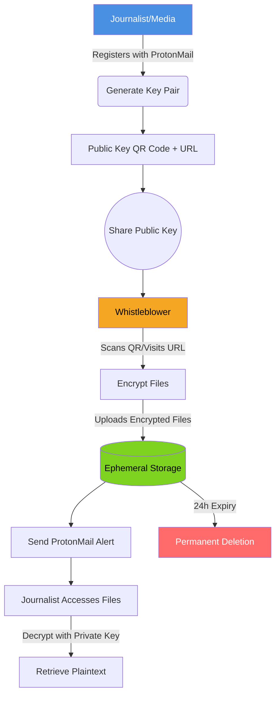

![[logo.png]]

### **Project Summary**  
**NymShare** is a secure, ephemeral file-sharing platform for whistleblowers and journalists.  
- **Journalists/Media** register with a ProtonMail address to receive a **public key** (shared via QR code/URL).  
- **Whistleblowers** encrypt files using the journalist’s public key and upload them to a temporary, self-destructing storage.  
- **Files auto-delete after 24 hours**, and journalists decrypt them using a private key stored offline.  
- **Core Tech**: Public-key cryptography, QR code generation, ephemeral cloud storage, and ProtonMail integration.  

### **Workflow Diagram**  

### **Diagram Breakdown**  
1. **Journalist Registration** (Blue): Generates a public/private key pair.  
2. **Public Key Sharing** (Default): QR code/URL shared publicly.  
3. **Whistleblower Flow** (Orange): Encrypts and uploads files.  
4. **Ephemeral Storage** (Green): Files held for 24 hours.  
5. **Decryption & Access** (Default): Journalist retrieves files with private key.  
6. **Auto-Deletion** (Red): Files permanently purged after expiry.  

### **Key Features Highlighted**  
- **End-to-End Encryption**: Public/private keypair ensures only the journalist can decrypt.  
- **QR-Code Obfuscation**: Reduces exposure of sensitive metadata.  
- **Time-Limited Access**: Forces urgency and minimizes data leaks.  

